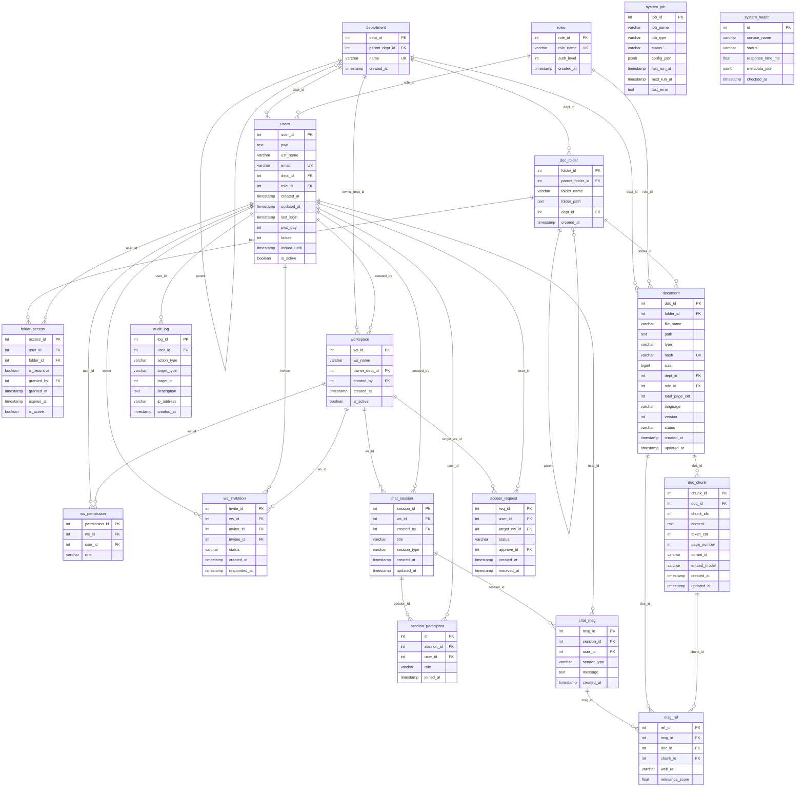

# Database Schema - On-Premise LLM & RAG System v2

## Overview

PostgreSQL 16 | 18 Tables | 2 Views | Alembic Migrations

## ER Diagram



## Table Groups

### Organization & RBAC (3 tables)

| Table | Purpose | Key Columns |
|-------|---------|-------------|
| `department` | Hierarchical dept structure | `parent_dept_id` for tree |
| `roles` | Role definitions | `auth_level` for access hierarchy |
| `users` | Authentication & profile | FK to dept + role, `locked_until` for security |

### Folder Access Control (2 tables)

| Table | Purpose | Key Columns |
|-------|---------|-------------|
| `doc_folder` | Hierarchical folder structure | `parent_folder_id`, `folder_path` |
| `folder_access` | Per-user folder permissions | `is_recursive`, `expires_at` for temporal access |

### Workspace & Collaboration (3 tables)

| Table | Purpose | Key Columns |
|-------|---------|-------------|
| `workspace` | Collaboration spaces | `owner_dept_id`, `is_active` |
| `ws_permission` | User roles in workspace | `role`: owner/editor/viewer |
| `ws_invitation` | Workspace invitations | `status`: pending/accepted/rejected |

### Chat (4 tables)

| Table | Purpose | Key Columns |
|-------|---------|-------------|
| `chat_session` | Chat conversations | `session_type`: private/shared |
| `session_participant` | Multi-user sessions | `role`: owner/editor/viewer |
| `chat_msg` | Individual messages | `sender_type`: user/assistant/system |
| `msg_ref` | RAG source references | `doc_id`, `chunk_id`, `relevance_score` |

### Document & RAG (2 tables)

| Table | Purpose | Key Columns |
|-------|---------|-------------|
| `document` | File metadata + RBAC | `status`: pending/processing/indexed/failed |
| `doc_chunk` | Chunks for vector search | `qdrant_id`, `embed_model`, `token_cnt` |

### System (4 tables)

| Table | Purpose | Key Columns |
|-------|---------|-------------|
| `access_request` | Workspace access requests | `status`: pending/approved/rejected |
| `audit_log` | Universal activity tracking | `action_type`, `target_type` + `target_id` |
| `system_job` | Background job scheduler | `config_json` (JSONB), `next_run_at` |
| `system_health` | Service health monitoring | `service_name`, `response_time_ms` |

## Access Control Flow

```
User Request
    |
    v
[1] Check users.is_active & locked_until
    |
    v
[2] Resolve dept_id -> department (+ parent hierarchy)
    |
    v
[3] Resolve role_id -> roles.auth_level
    |
    v
[4] Check folder_access (user_id + folder_id, is_recursive, expires_at)
    |
    v
[5] Check ws_permission (if workspace-scoped request)
    |
    v
[6] Filter documents by dept_id + role_id + folder access
    |
    v
[7] Log to audit_log
```

## Views

| View | Purpose |
|------|---------|
| `user_activity_summary` | Per-user action counts, query counts, last activity |
| `document_stats` | Per-document chunk counts, department, folder, status |

## Seed Data

Initial deployment creates:
- **Departments**: Admin, Research, Clinical_Team, QA
- **Roles**: Admin (100), Manager (50), Member (10), Viewer (1)

## Schema Files

| File | Purpose |
|------|---------|
| `database/init.sql` | Full DDL for fresh PostgreSQL setup |
| `backend/app/models.py` | SQLAlchemy ORM models |
| `alembic/versions/20260216_0001_*.py` | Alembic migration (v1) |
